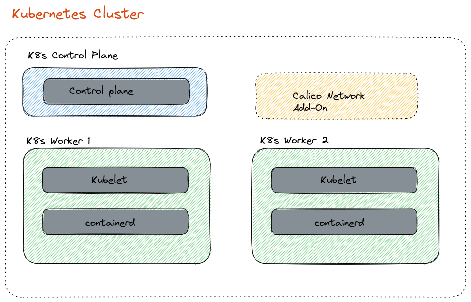

# How to build step by step a Kubernetes Cluster




## :eyes: Relevant Documentation

:point_right: [Creating a cluster with kubeadm](https://kubernetes.io/docs/setup/production-environment/tools/kubeadm/create-cluster-kubeadm/)

:point_right: [kubectl Cheat Sheet](https://kubernetes.io/docs/reference/kubectl/cheatsheet/)sudio

:point_right: https://etcd.io/


## :construction_worker:Let's get our hands dirty 


```shell
vagrant ssh control-plane                        
```

```shell
ssh-keygen -t rsa -b 4096
```

```shell
ssh-copy-id node-worker1
```

```shell
ssh-copy-id node-worker2
```


:warning: <u>**we need to do the following on all nodes**</u> 


before updating packages

```shell
sudo apt-get update && sudo apt-get upgrade -y
```


define some environment variables for the next tasks

```shell
export KUBERNETES_VERSION="1.25.0-00"
export CONTAINERD_VERSION="1.6.15"
export RUNC_VERSION="1.1.1"
```


Create configuration file for **`containerd`**

```shell
cat <<EOF | sudo tee /etc/modules-load.d/containerd.conf 
overlay
br_netfilter
EOF
```


Load modules

```shell
sudo modprobe overlay 
sudo modprobe br_netfilter
```


Set system configurations for Kubernetes networking

```shell
cat <<EOF | sudo tee /etc/sysctl.d/99-kubernetes-cri.conf 
net.bridge.bridge-nf-call-iptables  = 1
net.bridge.bridge-nf-call-ip6tables = 1
net.ipv4.ip_forward                 = 1
EOF
```


Apply new settings

```shell
sudo sysctl --system
```


Install containerd

```shell
wget https://github.com/containerd/containerd/releases/download/v$CONTAINERD_VERSION/containerd-$CONTAINERD_VERSION-linux-amd64.tar.gz
sudo tar Czxvf /usr/local containerd-$CONTAINERD_VERSION-linux-amd64.tar.gz
```

```shell
wget https://raw.githubusercontent.com/containerd/containerd/main/containerd.service
sudo mv containerd.service /usr/lib/systemd/system/
```

```shell
sudo systemctl daemon-reload
sudo systemctl enable --now containerd
```


Install runC

```shell
wget https://github.com/opencontainers/runc/releases/download/v$RUNC_VERSION/runc.amd64
sudo install -m 755 runc.amd64 /usr/local/sbin/runc
```


Generate default containerd configuration and save to the newly created default file

```shell
sudo mkdir -p /etc/containerd
sudo containerd config default | sudo tee /etc/containerd/config.toml
sudo sed -i 's/SystemdCgroup \= false/SystemdCgroup \= true/g' /etc/containerd/config.toml
```


Restart containerd to ensure new configuration file usage

```shell
sudo systemctl restart containerd
```


Disable swap

```shell
sudo swapoff -a
```


 keeps the swaf off during reboot

```shell
(crontab -l 2>/dev/null; echo "@reboot /sbin/swapoff -a") | crontab - || true
```


Install dependency packages

```shell
sudo apt-get update 
sudo apt-get install -y apt-transport-https curl
```


Download and add GPG key

```shell
curl -s https://packages.cloud.google.com/apt/doc/apt-key.gpg | sudo apt-key add -
```


Add Kubernetes to repository list

```shell
cat <<EOF | sudo tee /etc/apt/sources.list.d/kubernetes.list
deb https://apt.kubernetes.io/ kubernetes-xenial main
EOF
```


Update packages and Install Kubernetes packages 

```shell
sudo apt-get update
sudo apt-get install -qy kubelet=$KUBERNETES_VERSION kubeadm=$KUBERNETES_VERSION kubectl=$KUBERNETES_VERSION
```

```shell
sudo apt-mark hold kubelet kubeadm kubectl
```


> **Note**: after performing the previous operations we must connect to the other nodes and do the same :arrow_double_up:
>
> ```shell
> ssh node-worker1
> ```
>
> ```shell
> ssh node-worker2
> ```


**On the controle-plane node**

```shell
export CONTROL_PLANE_IP="10.0.0.10"
export POD_CIDR="192.168.0.0/16"
export KUBERNETES_VERSION="1.25.0"
```


pull the images that kubeadm requires.

```shell
sudo kubeadm config images pull
```


:eyes: [kubeadm init](https://kubernetes.io/docs/reference/setup-tools/kubeadm/kubeadm-init/)

```shell
sudo kubeadm init --pod-network-cidr=$POD_CIDR --kubernetes-version=$KUBERNETES_VERSION --apiserver-advertise-address=$CONTROL_PLANE_IP
```


:eyes: [kubectl Cheat Sheet](https://kubernetes.io/docs/reference/kubectl/cheatsheet/)

```shell
sudo apt-get install bash-completion
```

```shell
echo "source <(kubectl completion bash)" >> /home/vagrant/.bashrc
echo "alias k=kubectl" >> /home/vagrant/.bashrc
echo "set ts=2 sw=2 et" >> /home/vagrant/.vimrc
echo "export do=\"--dry-run=client -o yaml\"" >> /home/vagrant/.profile
echo "complete -o default -F __start_kubectl k" >> /home/vagrant/.profile
```

```shell
source .bashrc
source .vimrc
source .profile
```


playground directory

```shell
mkdir -p /home/vagrant/playground
```


Set **kubectl** access:

```shell
mkdir -p $HOME/.kube && \
sudo cp -i /etc/kubernetes/admin.conf $HOME/.kube/config && \
sudo chown $(id -u):$(id -g) $HOME/.kube/config
```


check access cluster

```shell
k get nodes
# or 
kubectl get nodes
```


Install CNI(*Container Network Interface*) : Calico Network Add-On

```shell
curl https://raw.githubusercontent.com/projectcalico/calico/v3.25.0/manifests/calico.yaml -O
kubectl apply -f calico.yaml
```


:watch: Wait until all is done

```shell
kubectl get pod -n kube-system -w | grep calico
```


install etcd-client

```shell
sudo apt-get install etcd-client
```


Install Metrics Server

```shell
kubectl apply -f https://raw.githubusercontent.com/scriptcamp/kubeadm-scripts/main/manifests/metrics-server.yaml
```


Join the Worker Nodes to the Cluster

```shell
export JOIN=$(kubeadm token create --print-join-command)
```


:point_right: on each worker `ssh node-worker1`  `ssh node-worker2`

```shell
ssh node-worker1 sudo $JOIN
```

```shell
ssh node-worker2 sudo $JOIN
```


verify

```shell
k get nodes -w
```


....

**:tada: Congratulations your kubernetes cluster is ready for use**

